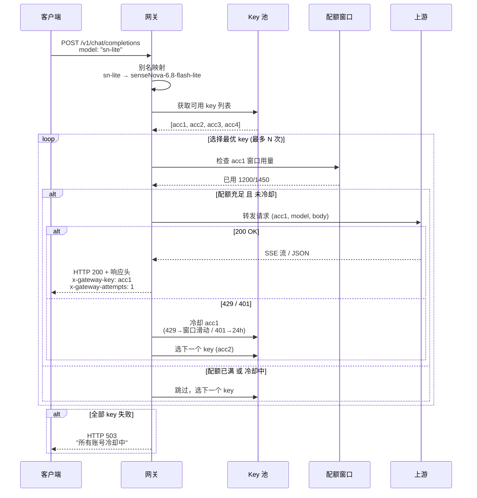
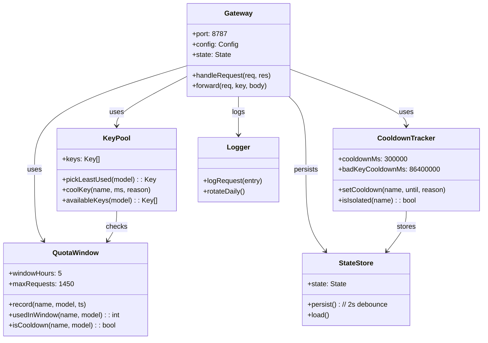

# sensenova-gateway

**Zero-dependency local OpenAI-compatible gateway that pools N SenseNova API keys into one endpoint.**

把 N 个 SenseNova 账号的 `sk-` key 聚合成**一个本地 OpenAI 兼容端点**，自动做配额滚动窗口、429/401 故障转移、冷却、别名映射、SSE 流式转发。**只用 Node 内置模块，无 npm install。**

---

## 🏗️ 架构总览

```mermaid
flowchart TB
    subgraph Client["🖥️ 客户端层 (OpenAI 兼容)"]
        direction LR
        C1[WorkBuddy]
        C2[Cursor]
        C3[Copilot]
        C4[任意 OpenAI SDK]
    end

    subgraph Gateway["🌐 sensenova-gateway (127.0.0.1:8787)"]
        direction TB

        subgraph Ingress["入口层"]
            direction LR
            I1[请求路由<br/>/v1/* 转发]
            I2[别名映射<br/>sn-lite → 真实 model]
        end

        subgraph Router["智能路由"]
            direction TB
            R1[Key 池选择器<br/>按 5h 窗口用量最少]
            R2[配额检查<br/>滚动窗口 ≤ 1450 次]
            R3[冷却过滤<br/>429/401 自动隔离]
        end

        subgraph Forward["转发层"]
            direction LR
            F1[HTTP 转发]
            F2[SSE 流式 pipe]
            F3[故障转移<br/>最多重试 N 个 key]
        end

        subgraph Ops["运维端点"]
            direction LR
            O1[GET /health]
            O2[GET /stats]
            O3[GET /v1/models]
        end

        Ingress --> Router --> Forward
    end

    subgraph Upstream["☁️ SenseNova 上游"]
        U1[token.sensenova.cn]
    end

    subgraph Storage["💾 本地状态 (无数据库)"]
        direction TB
        S1[keys.json<br/>N 个账号 key 池]
        S2[state.json<br/>窗口用量 + 冷却状态]
        S3[logs/gateway-*.log<br/>请求日志]
        S4[config.json<br/>端口/别名/配额]
    end

    Client -->|POST /v1/chat/completions<br/>OpenAI 协议| Gateway
    Gateway -->|HTTPS + Authorization| Upstream
    Upstream -.->|SSE / JSON| Gateway
    Storage <-.->|读写 (2s debounce)| Gateway
```

**关键设计点：**
- **客户端零改动** — 只需把 `base_url` 改成 `http://127.0.0.1:8787/v1`
- **路由三件套** — Key 选择 + 配额检查 + 冷却过滤，串行判断
- **故障转移** — 429/401 自动切下一个 key，最多试 `maxAttempts` 次
- **零依赖** — 只用 Node 内置 `http`/`https`/`fs`/`path`，`node server.js` 直接跑

---

## 🔁 请求生命周期



**关键机制：**
1. **用量最少优先** — 不是 round-robin，而是按当前 5h 窗口内的实时用量排序
2. **冷却到窗口滑动** — 429 如果是窗口用满，冷却到最早那次请求滑出窗口（而非固定 300s）
3. **SSE 直接 pipe** — `upstream.pipe(res)`，不复制内容，边收边转
4. **响应头透传诊断信息** — `x-gateway-key`（用了哪个账号）、`x-gateway-attempts`（试了几次）

---

## 📊 配额窗口可视化

```mermaid
gantt
    title 5 小时滚动窗口 (示例)
    dateFormat  HH:mm
    axisFormat  %H:%M
    
    section acc1 (key-1)
    请求 1-500   :done, t1, 10:00, 11:30
    请求 501-1000 :done, t2, 11:30, 13:00
    请求 1001-1450 :active, t3, 13:00, 15:00
    冷却中 (窗口用满) :crit, t4, 15:00, 15:30
    恢复 (最早请求滑出) :done, t5, 15:30, 16:00

    section acc2 (key-2)
    请求 1-800   :done, s1, 10:00, 12:00
    429 冷却 (偶发限流) :crit, s2, 12:00, 12:05
    请求 801-1400 :active, s3, 12:05, 15:00

    section acc3 (key-3)
    请求 1-300   :done, a1, 11:00, 12:00
    空闲 (用量最少) :milestone, a2, 12:00, 15:00

    section acc4 (key-4)
    401 隔离 (24h) :crit, b1, 14:00, 15:00
```



**窗口机制：**
- **滚动窗口** — 不是固定 5 小时块，而是任意 5 小时内的请求计数
- **自动恢复** — 窗口滑动后，之前被冷却的账号自动可用
- **独立计数** — 每个账号 × 每个模型独立计数，互不干扰

---

## 🧩 核心组件



---

## 💼 业务背景

### 品牌概况

**中高端烘焙连锁品牌**，华南地区 45 家门店（42 自营 + 3 合作），3,700+ SKU 商品，蛋糕烘焙为主，客单价约 ¥25 的社区高频生意。

**用户资产**：
- 全网消费客户 9.5 万，复购率 51.6%
- 企微好友 7.7 万（含 POS 导入）
- 隐藏打卡任务激活 7.6 万人

### 9 月经营情况（截至 9 月 29 日）

**整体业绩**：
- 9 月 1-28 日营业额 963 万，已完成 8 月全月（1,030 万）的 93.5%
- 客单价 25.1 元，比 8 月（21.9 元）提升 14.6%

**中秋主线**：
- W39（9/21-27）营业额 287.3 万，环比 +24%
- 峰值中秋当天（9/25）66.2 万
- 月饼定标 ¥248 万已完成 99.9%，现在进入清仓期（9/26 起日均 35 万）
- 去掉月饼后，9 月常规烘焙盘比 8 月略降，属于节后正常波动

**当前节点**：
- 月饼旺季已收官，接下来重点回到日常盘
- 生日蛋糕系列是增长主力（W39 +67%）
- 周五~周日是固定高峰，工作日看连带率（件/单 1.44，超长葡挞等爆品可带动）

### 正在跑的私域机制

**每日考核两项**：
- 加企微好友
- 出示会员码（当前瓶颈：占比仅 13.7%，累计覆盖率 28.2%，提升空间大）

**自动化工具**：
- 隐藏打卡（4 档券）
- 3 元新人券
- 27 组标签体系 + MA 自动打标
- 每天早上 7 点看板 + 10 点刷新 + 9:30 异常门店播报

### AI 应用场景

**痛点**：
- 需要批量生成营销物料（海报、宣传视频、社群素材），单个 AI 账号配额不够用
- 多个 AI 工具/账号，客户端只认 OpenAI 兼容协议
- 手动切换账号/key 效率低，容易忘记哪个账号快用完了

**解决方案**：
自建本地网关，把多个 AI 账号聚合成一个 OpenAI 兼容端点，自动做配额管理、故障转移、冷却隔离。客户端零改动，只需改 `base_url`。

**核心价值**：
- **配额最大化**：N 个账号 = N 倍并发能力
- **客户端零改动**：任何 OpenAI SDK 直接可用
- **自动故障转移**：429/401 自动切下一个 key，无需人工干预
- **成本可控**：本地运行，不经过第三方服务

---

## 为什么做这个

SenseNova 公测期的配额是**按账号**算的：一个账号下所有 key 共享同一份 5 小时/周窗口。想放大并发只能多账号，但：

- 多账号 = 客户端 N 个不同 base URL、N 套 key、N 套错误处理
- 客户端（WorkBuddy、Copilot、Cursor……）只认 OpenAI 兼容协议，没法直连多个 SenseNova 账号
- 官方也没提供"账号池"这种能力

**所以自己写一个中间层**：客户端只连本地一个地址，网关在背后做负载均衡、故障转移、冷却隔离、别名改写。**客户端零改动**，把 N 个账号的能力对上层呈现为一个"更稳定的 OpenAI 兼容端点"。

## 🚀 快速开始

## 核心特性

| 特性 | 说明 |
|---|---|
| **零依赖** | 只用 Node ≥ 22 内置 `http`/`https`/`fs`/`path`，不装任何 npm 包 |
| **多 key 轮询** | 按"当前 5h 窗口内用量最少"选账号，不是简单 round-robin |
| **滚动窗口配额** | 每个账号-每个模型独立计数，超上限自动排除，窗口滑动后自动恢复 |
| **429/401 冷却** | 429 冷却到窗口滑动或 300s，401/403 隔离 24h；其他 5xx 冷却 30s |
| **故障转移** | 单个 key 报错自动切下一个，最多试 `maxAttempts` 次 |
| **别名映射** | 客户端写 `sn-lite`，网关改写为上游真实 model id，切换模型只改一行配置 |
| **SSE 流式转发** | 完整透传 `text/event-stream`，含 `[DONE]` 终止符 |
| **本地状态持久化** | `state.json` 记录 5h 窗口用量，进程重启不丢（延迟 2s 落盘） |
| **健康检查** | `GET /health`、`GET /stats`、`GET /v1/models` 三个运维端点 |
| **请求日志** | 每条请求记录 model / key / attempts / 耗时，落 `logs/gateway-YYYY-MM-DD.log` |
| **16 项离线自测** | `test/smoke.js` 用 `mock-upstream.js` 模拟上游，跑完不花一分钱配额 |

```bash
# 1. 复制 key 配置
cp keys.example.json keys.json    # 然后编辑填入真实 sk- 开头的 key

# 2. 启动（前台）
node server.js

# 或后台静默启动
node start-gateway.js
node stop-gateway.js              # 停
node status.js                    # 看各账号用量

# 3. 自测（不花配额，模拟上游跑一遍）
node test/smoke.js
```

然后任何 OpenAI SDK 只要改 base URL：

```python
from openai import OpenAI
client = OpenAI(base_url="http://127.0.0.1:8787/v1", api_key="sk-local-gateway")
resp = client.chat.completions.create(
    model="sensenova-6.8-flash-lite",   # 或 aliases 里的别名
    messages=[{"role": "user", "content": "你好"}]
)
```

## 配置（config.json）

| 字段 | 默认 | 说明 |
|---|---|---|
| `port` | `8787` | 监听端口 |
| `host` | `127.0.0.1` | 只监听回环地址，不对外 |
| `upstream` | `https://token.sensenova.cn` | 上游 API 地址 |
| `localToken` | `""` | 若填空则不校验本地令牌；填了就要求 `Authorization: Bearer <token>` |
| `windowHours` | `5` | 滚动窗口长度 |
| `maxRequestsPer5h` | `1450` | 单账号-单模型窗口内请求上限（官方 1500，留 50 余量） |
| `cooldownSeconds` | `300` | 429 冷却秒数（配额未耗尽时） |
| `badKeyCooldownSeconds` | `86400` | 401/403 冷却秒数（24 小时） |
| `maxAttempts` | `4` | 单次请求最多尝试几个 key |
| `idleTimeoutMs` | `120000` | 上游静默超时 |
| `defaultModel` | `sensenova-6.8-flash-lite` | 请求没写 model 时用的默认值 |
| `aliases` | `{}` | 对外模型名 → 上游真实 model id |
| `logRequests` | `true` | 是否记录请求日志 |

**key 池支持多种粘贴格式**（`keys.json` 或同级 `keys.txt`）：
- `{"keys":[{"name":"acc1","key":"sk-xx"}]}`
- `{"keys":["sk-xx","sk-yy"]}`
- `{"acc1":"sk-xx","acc2":"sk-yy"}`
- `["sk-xx","sk-yy"]`
- 或纯文本一行一个 key（`#` 开头视为注释）

## 端点

| 方法 | 路径 | 说明 |
|---|---|---|
| GET | `/health` | 存活 + 可用账号数（不需鉴权） |
| GET | `/stats` | 各账号 5h 窗口用量、冷却剩余、成功/失败/切号次数 |
| GET | `/v1/models` | 可用模型清单 |
| 任意 | `/v1/*` | 转发到上游（OpenAI 兼容协议） |
| 其他 | 其他路径 | 404，并给出提示 |

响应头额外带 `x-gateway-key`（用了哪个账号）、`x-gateway-attempts`（试了几次）、`x-gateway-model`（改写后的真实 model id），方便排错。

## 关键设计决策

**为什么"按用量最少"选账号，而不是简单 round-robin？**
Round-robin 只看请求顺序，不看当前窗口内的实时负载。如果某个账号刚被上游打了 429，round-robin 下一次还是会给它派活；用量最少策略会在选账号时**同时**考虑当前窗口计数和冷却状态，天然规避这两种情况。

**为什么 5h 窗口用数组 + 二分而不是 Redis？**
- 单机、本地场景，Redis 是过度设计
- 数组按时间升序，`while (arr[keepFrom] < cut) keepFrom++` 是**线性扫描 + 截断**，O(n) 但 n 有上限（`maxRequestsPer5h`），实际 < 1450 次算术
- 状态全在内存，进程重启不丢是因为有 `state.json` 兜底
- 延迟 2s 落盘避免高频 I/O

**为什么 429 冷却不是固定秒数？**
如果 429 是因为"当前 5h 窗口已用满"，固定 300s 冷却后立刻又会 429。策略是**冷却到最早那次请求滑出窗口**：`coolUntil = arr[0] + windowMs - now`，这样一冷却就等于等到有配额可用。真正的偶发限流（窗口未满）走默认 300s。

**为什么别名写死在配置里，不做动态路由？**
场景是"换上游模型只需要改一行"。动态路由（按 prompt 长度选模型、按语言选模型）需要额外的路由表 + 评估器，对这个用例是过度工程。别名映射解决 80% 的场景，剩下 20% 用两个网关实例分开部署。

**为什么保留原样的错误响应？**
`RETRY_STATUS`（401/403/408/409/425/429/500/502/503/504/529）只处理"值得重试"的错误码；其他错误（400/404/422 等客户端错误）原样透传，避免"网关吞错误导致客户端以为是自己错了但其实是上游格式问题"。

**为什么零依赖？**
生产环境一个 `npm install` 就要 30 秒 + 一堆 CVE。核心只用 `http`、`https`、`fs`、`path` 四个内置模块，**530 行核心代码**、`node server.js` 直接跑，无需构建、无需部署容器。

## 测试

`test/smoke.js` 用 `mock-upstream.js` 起一个**本地模拟上游**（可控返回 200/401/429/500），跑完 16 项检查**不花一分钱真实配额**：

```
PASS | 模拟上游启动
PASS | 网关启动 + /health
PASS | 健康检查识别 4 个 key
PASS | 前 4 次请求轮询到 4 个不同账号
PASS | 第 5 次请求回到用量最少的账号
PASS | 自定义模型别名映射生效
PASS | 流式(SSE)转发正常
PASS | 非 /v1 路径返回 404
PASS | 12 次请求在 4 个账号间均分，无人超限
PASS | 配额均分后仍能继续服务（优雅降级）
PASS | 单 key 429 自动切换其它账号
PASS | 失效 key(401) 被长冷却隔离
PASS | 被隔离后请求仍由健康账号完成
PASS | 全部账号 429 时回传上游错误码
PASS | 全部冷却时返回 503 + 中文提示
PASS | 未填 key 时给出明确指引
16 / 16 通过
```

## Trade-offs & Known Limitations

- **只支持 SenseNova 上游**：`upstream` 字段虽然是通用的，但配额窗口参数、别名列表都是照 SenseNova 公测期口径写的。想换其他上游（如 OpenAI、Anthropic、Groq）需要改 `maxRequestsPer5h`、`defaultModel`、`aliases` 三处。
- **不校验请求体大小**：上游会校验，网关原样转发。真出超大请求的话，`idleTimeoutMs` 会兜底超时。
- **状态持久化用文件不是 DB**：单机本地够用；上生产要么接 Redis，要么用 `piscina` 之类的进程池。
- **多账号玩法的合规边界**：多个 SenseNova 账号摊配额的用法属于"钻公测配额的空子"，**平台有权风控/封号**。别拿主账号试，别放在对外服务上。这个仓库解决的是"怎么用一个 OpenAI 客户端吃满多个本地账号"的**技术**问题，合规问题你自己判断。

## 目录结构

```
sensenova-gateway/
├── server.js                # 网关本体（~530 行，零依赖）
├── config.json              # 配置（端口 / 上游 / 配额 / 别名 / 冷却）
├── keys.example.json        # key 池模板（复制为 keys.json 后编辑）
├── start-gateway.js         # 后台启动
├── stop-gateway.js          # 停止后台
├── status.js                # 查看状态与用量
├── test/
│   ├── mock-upstream.js     # 本地模拟上游（可控返回码）
│   └── smoke.js             # 16 项离线自测
├── package.json
├── LICENSE                  # MIT
├── DECISIONS.md             # 架构决策记录
└── README.md
```

## 相关项目

- [`kb-cli`](https://github.com/Babymrbbbb/kb-cli) — 姊妹项目：多子库 × 多层的本地知识库检索器，同样是零依赖、单文件、CLI 优先

## License

MIT © Babymrbbbb
