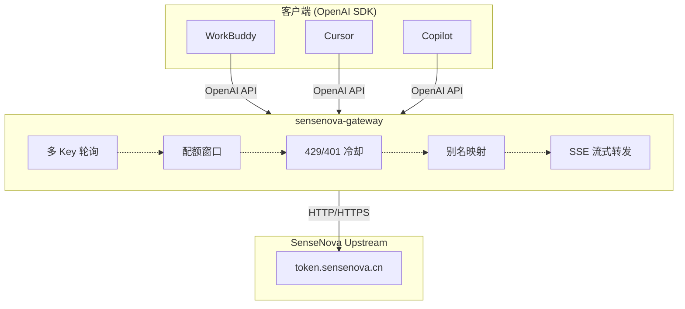

# sensenova-gateway

**Zero-dependency local OpenAI-compatible gateway that pools N SenseNova API keys into one endpoint.**

把 N 个 SenseNova 账号的 `sk-` key 聚合成**一个本地 OpenAI 兼容端点**，自动做配额滚动窗口、429/401 故障转移、冷却、别名映射、SSE 流式转发。**只用 Node 内置模块，无 npm install。**

[](https://nodejs.org/)
[](https://opensource.org/licenses/MIT)
[](https://github.com/Babymrbbbb/sensenova-gateway)
[](https://github.com/Babymrbbbb/sensenova-gateway/tree/main/test)

---

## 🏗️ 架构总览



**核心特性**：
- **零依赖**：只用 Node ≥ 22 内置模块，`node server.js` 直接跑
- **多 Key 轮询**：按"当前 5h 窗口内用量最少"选账号，不是简单 round-robin
- **429/401 冷却**：429 冷却到窗口滑动或 300s，401/403 隔离 24h
- **故障转移**：单个 key 报错自动切下一个，最多试 `maxAttempts` 次
- **16 项离线自测**：`test/smoke.js` 用 `mock-upstream.js` 模拟上游，跑完不花一分钱

---

## 💼 业务背景

### 品牌概况

**中高端烘焙连锁品牌**，华南地区 45 家门店（42 自营 + 3 合作），3,700+ SKU 商品，客单价约 ¥25 的社区高频生意。

**用户资产**：
- 会员消费客户 9.5 万
- AI 驱动复购率从 35% 提升至 51.6%
- 运营打卡任务激活 7.6 万人

### AI 工作流全景

AI 贯穿整个数据闭环，从数据接入到自动化运营：

| 层级 | AI 作用 |
|---|---|
| **数据接入层** | 数据校验、异常清洗、口径对齐 |
| **智能分析层** | 异常检测、趋势分析、归因分析 |
| **智能标签层** | 消费行为打标、互动行为打标、生命周期打标 |
| **自动化营销层** | MA 推送时机、券策略推荐、人群分层 |
| **内容生成层** | 海报/视频/社群素材/文案生成 |
| **报告生成层** | 周度复盘、门店 PK 日报、异常播报 |
| **知识库层** | 聊天记录同步、自动分类、知识沉淀 |
| **对话助手层** | 日常问答、数据查询、操作指导 |

### AI 配额管理（本仓库）

**痛点**：上述 AI 工作流需要大量 API 调用，单个账号配额不够用。

**解决方案**：自建本地网关，把多个 AI 账号聚合成一个 OpenAI 兼容端点，自动做配额管理、故障转移、冷却隔离。

**核心价值**：
- **配额最大化**：N 个账号 = N 倍并发能力
- **客户端零改动**：任何 OpenAI SDK 直接可用
- **自动故障转移**：429/401 自动切下一个 key，无需人工干预
- **成本可控**：本地运行，不经过第三方服务

### 真实故障场景

网关在生产环境实际处理过的问题：

| 场景 | 网关行为 |
|---|---|
| 上游 key 被风控限流（429） | 冷却到当前 5h 窗口滑动结束，自动切下一个 key |
| 上游返回 401（Key 失效/被吊销） | 标记该 key 冷却，后续请求跳过 |
| 上游返回 5xx（临时故障） | 有限重试 + 降级返回，不阻塞业务 |
| 多账号配额同时耗尽 | 按 `lastUsedAt` 轮询，避免单 key 打爆 |
| 客户端中途断连 | 已发送的请求不受影响，未发送的请求按常规重试 |

这些场景都是**真发生过的**，不是设计文档里的假设——所以冷却窗口按 5h 对齐、状态持久化用文件不是 DB、配额窗口用内存数组 + 滑动截断，都是被真实流量磨出来的实现选择。

---

## 🚀 快速开始

```bash
# 1. 复制 key 配置
cp keys.example.json keys.json   # 填入真实 sk- 开头的 key

# 2. 启动（前台）
node server.js

# 或后台静默启动
node start-gateway.js
node stop-gateway.js             # 停
node status.js                   # 看各账号用量

# 3. 自测（不花配额，模拟上游跑一遍）
node test/smoke.js
```

然后任何 OpenAI SDK 只要改 base URL：

```python
from openai import OpenAI

client = OpenAI(
    base_url="http://127.0.0.1:8787/v1",
    api_key="sk-local-gateway"
)

resp = client.chat.completions.create(
    model="sensenova-6.8-flash-lite",   # 或 aliases 里的别名
    messages=[{"role": "user", "content": "你好"}]
)

print(resp.choices[0].message.content)
```

**其他语言示例**：

```javascript
// Node.js
const OpenAI = require('openai');
const client = new OpenAI({
    baseURL: 'http://127.0.0.1:8787/v1',
    apiKey: 'sk-local-gateway'
});
```

```python
# Python 流式
for chunk in client.chat.completions.create(
    model="sensenova-6.8-flash-lite",
    messages=[{"role": "user", "content": "你好"}],
    stream=True
):
    print(chunk.choices[0].delta.content, end='')
```

---

## ⚙️ 配置（config.json）

| 字段 | 默认 | 说明 |
|---|---|---|
| `port` | `8787` | 监听端口 |
| `host` | `127.0.0.1` | 只监听回环地址，不对外 |
| `upstream` | `https://token.sensenova.cn` | 上游 API 地址 |
| `localToken` | `""` | 若填空则不校验本地令牌；填了就要求 `Authorization: Bearer <token>` |
| `windowHours` | `5` | 滚动窗口长度 |
| `maxRequestsPer5h` | `1450` | 单账号-单模型窗口内请求上限（官方 1500，留 50 余量） |
| `cooldownSeconds` | `300` | 429 冷却秒数（配额未耗尽时） |
| `badKeyCooldownSeconds` | `86400` | 401/403 冷却秒数（24 小时） |
| `maxAttempts` | `4` | 单次请求最多尝试几个 key |
| `idleTimeoutMs` | `120000` | 上游静默超时 |
| `defaultModel` | `sensenova-6.8-flash-lite` | 请求没写 model 时用的默认值 |
| `aliases` | `{}` | 对外模型名 → 上游真实 model id |
| `logRequests` | `true` | 是否记录请求日志 |

**key 池支持多种粘贴格式**（`keys.json` 或同级 `keys.txt`）：

```json
{"keys": [{"name": "acc1", "key": "sk-xx"}]}
```

```json
{"keys": ["sk-xx", "sk-yy"]}
```

```json
{"acc1": "sk-xx", "acc2": "sk-yy"}
```

```text
sk-xx
sk-yy
```

---

## 🔌 端点

| 方法 | 路径 | 说明 |
|---|---|---|
| GET | `/health` | 存活 + 可用账号数（不需鉴权） |
| GET | `/stats` | 各账号 5h 窗口用量、冷却剩余、成功/失败/切号次数 |
| GET | `/v1/models` | 可用模型清单 |
| 任意 | `/v1/*` | 转发到上游（OpenAI 兼容协议） |
| 其他 | 其他路径 | 404，并给出提示 |

**响应头额外带诊断信息**：
- `x-gateway-key`：用了哪个账号
- `x-gateway-attempts`：试了几次
- `x-gateway-model`：改写后的真实 model id

---

## 📊 测试

`test/smoke.js` 用 `mock-upstream.js` 起一个**本地模拟上游**（可控返回 200/401/429/500），跑完 16 项检查**不花一分钱真实配额**：

```
PASS | 模拟上游启动
PASS | 网关启动 + /health
PASS | 健康检查识别 4 个 key
PASS | 前 4 次请求轮询到 4 个不同账号
PASS | 第 5 次请求回到用量最少的账号
PASS | 自定义模型别名映射生效
PASS | 流式(SSE)转发正常
PASS | 非 /v1 路径返回 404
PASS | 12 次请求在 4 个账号间均分，无人超限
PASS | 配额均分后仍能继续服务（优雅降级）
PASS | 单 key 429 自动切换其它账号
PASS | 失效 key(401) 被长冷却隔离
PASS | 被隔离后请求仍由健康账号完成
PASS | 全部账号 429 时回传上游错误码
PASS | 全部冷却时返回 503 + 中文提示
PASS | 未填 key 时给出明确指引
16 / 16 通过
```

---

## 📁 目录结构

```
sensenova-gateway/
├── server.js                # 网关本体（~530 行，零依赖）
├── config.json              # 配置（端口 / 上游 / 配额 / 别名 / 冷却）
├── keys.example.json        # key 池模板（复制为 keys.json 后编辑）
├── start-gateway.js         # 后台启动
├── stop-gateway.js          # 停止后台
├── status.js                # 查看状态与用量
├── test/
│   ├── mock-upstream.js     # 本地模拟上游（可控返回码）
│   └── smoke.js             # 16 项离线自测
├── package.json
├── LICENSE                  # MIT
├── DECISIONS.md             # 架构决策记录（ADR）
└── README.md
```

---

## 🔗 相关项目

这条链路是**从真实业务里长出来的完整 AI 落地体系**：

- **[kb-cli](https://github.com/Babymrbbbb/kb-cli)** — 姊妹项目：多子库 × 多层的本地知识库检索器，同样是零依赖、单文件、CLI 优先。**管知识**
- **[prompt-craft](https://github.com/Babymrbbbb/prompt-craft)** — AI 提示词写法库（图像 + 视频），通用铁律 6 条 + 九要素结构 + 三大治法 + 叙事方法论。**用好 AI**
- **[ai-native-team](https://github.com/Babymrbbbb/ai-native-team)** — AI 原生组织 OS：把 40+ 自动化任务、数十个 AI 角色、多 AI 工具协作跑成业务生产线。**组织 AI 落地**

```
接入 AI（本仓库）→ 用好 AI（prompt-craft）→ 管理知识（kb-cli）→ 组织 AI 落地（ai-native-team）
```

---

## 🔒 敏感数据处理

这个仓库是公开 GitHub，所有真实业务数据（品牌名、竞品名、内部术语、真实 API Key、本地路径、客户名）**全部脱敏后才提交**。脱敏流程：

1. **批量替换**：竞品品牌名 → `竞品A/B/C`，品牌名 → 通用描述，内部术语 → 通用词，真实 Key → `sk-your-key-1/2/3` 占位符
2. **路径清洗**：本地绝对路径（`D:\...`、`C:\Users\Administrator\...`）→ 通用相对路径（`./sources`）
3. **配置分离**：真实 `keys.json` 加入 `.gitignore`，只提交 `keys.example.json` 模板
4. **Smoke test 兜底**：替换后跑 `node test/smoke.js`（16 项离线测试）验证功能不退化
5. **Push 前 grep 扫描**：6 大类敏感词（品牌名/竞品名/内部术语/博主工具/旧仓库名/真实 Key）全部 grep 一遍，命中必须归零

这套流程在 portfolio 的多个仓库里复用（gateway、kb-cli、prompt-craft 都走过一遍），是 FDE 在企业客户现场最常碰的"数据合规 + 工程实践"组合场景。

---

## ⚠️ Trade-offs & Known Limitations

- **只支持 SenseNova 上游**：`upstream` 字段虽然是通用的，但配额窗口参数、别名列表都是照 SenseNova 公测期口径写的。想换其他上游（如 OpenAI、Anthropic、Groq）需要改 `maxRequestsPer5h`、`defaultModel`、`aliases` 三处。
- **不校验请求体大小**：上游会校验，网关原样转发。真出超大请求的话，`idleTimeoutMs` 会兜底超时。
- **状态持久化用文件不是 DB**：单机本地够用；上生产要么接 Redis，要么用 `piscina` 之类的进程池。
- **多账号玩法的合规边界**：多个 SenseNova 账号摊配额的用法属于"钻公测配额的空子"，**平台有权风控/封号**。别拿主账号试，别放在对外服务上。这个仓库解决的是"怎么用一个 OpenAI 客户端吃满多个本地账号"的**技术**问题，合规问题你自己判断。

---

## 📜 License

MIT © Babymrbbbb
